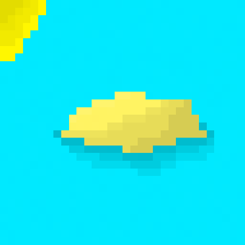

<h1 style='color: red'>Hello, I'm Thiago</h1>
<h2>Software development student</h2>

I'm on github because I want to meet people and contributte to open source projects.

Hope we can get along, see ya, bye.

